# Medical Record Digitization Mobile App for Patients and Doctors

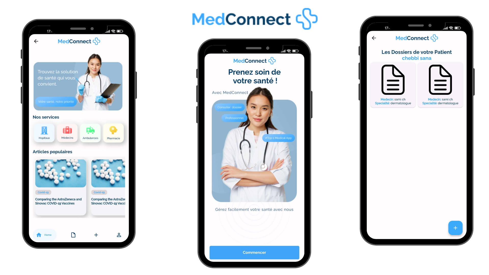

This project consists of two mobile applications designed for patients and doctors to digitize and manage patient medical records.

## Applications

### MedConnect Doctor (Mobile App)
**MedConnect Doctor** allows doctors to scan a patient's QR code to access previous medical records, add new ones, and convert records into PDF format for downloading or emailing.

### MedConnect Patient (Mobile App)
**MedConnect Patient** enables patients to create an account, generate a QR code for doctors, view their medical records, and convert them into PDFs for downloading or sharing via email.

## Screenshot
### MedConnect Doctor (Mobile App)
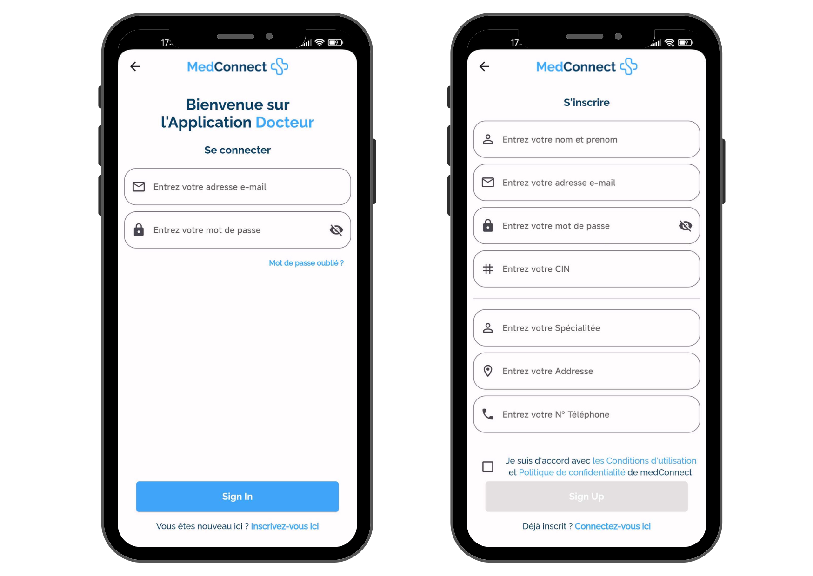
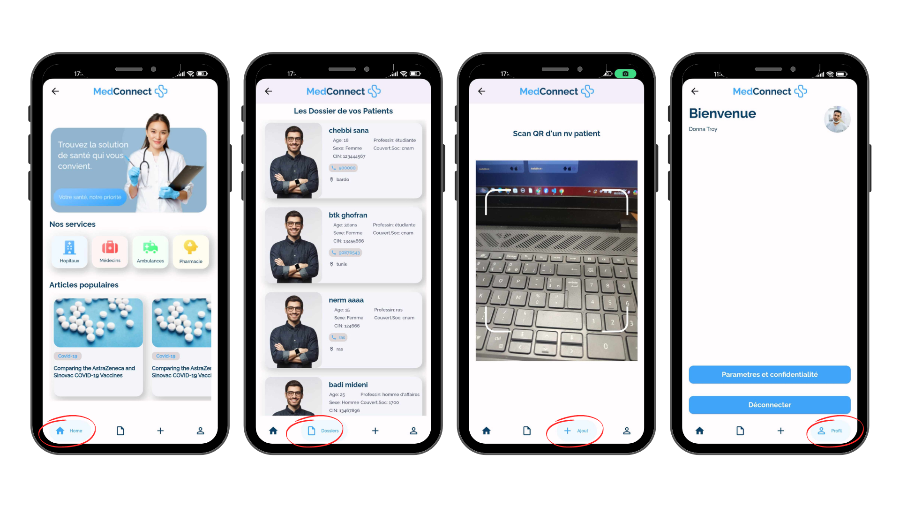
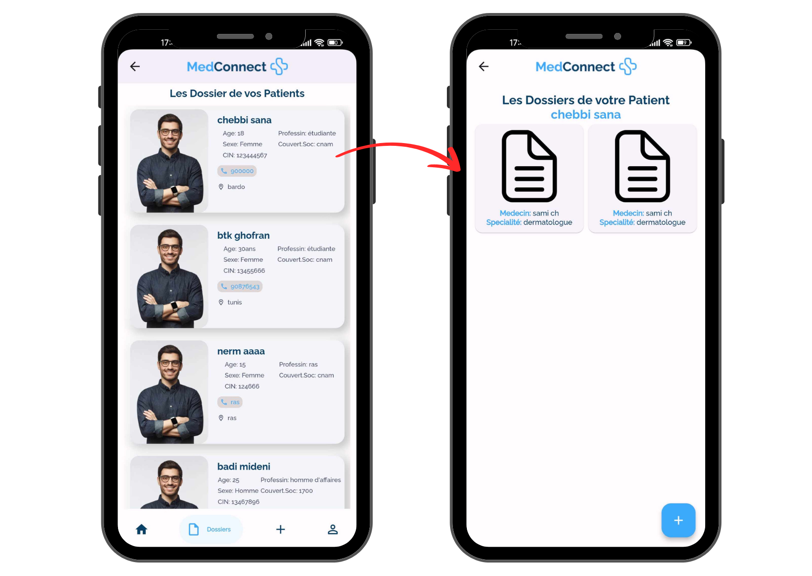
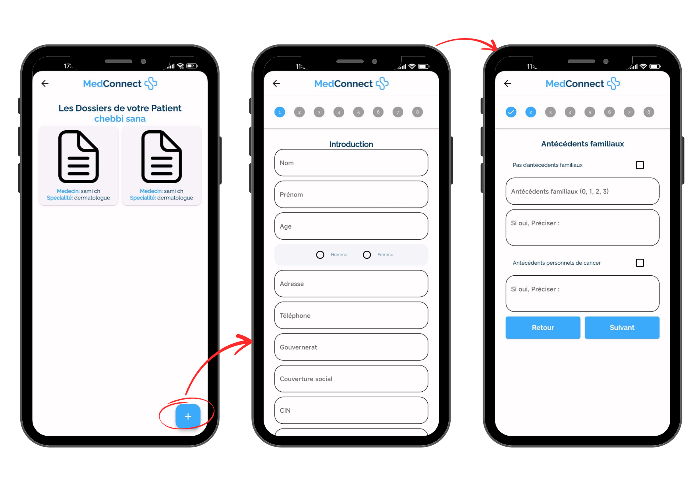
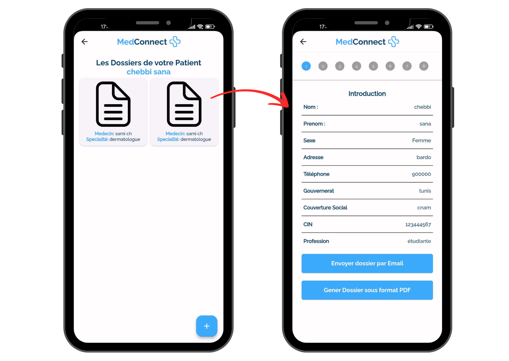
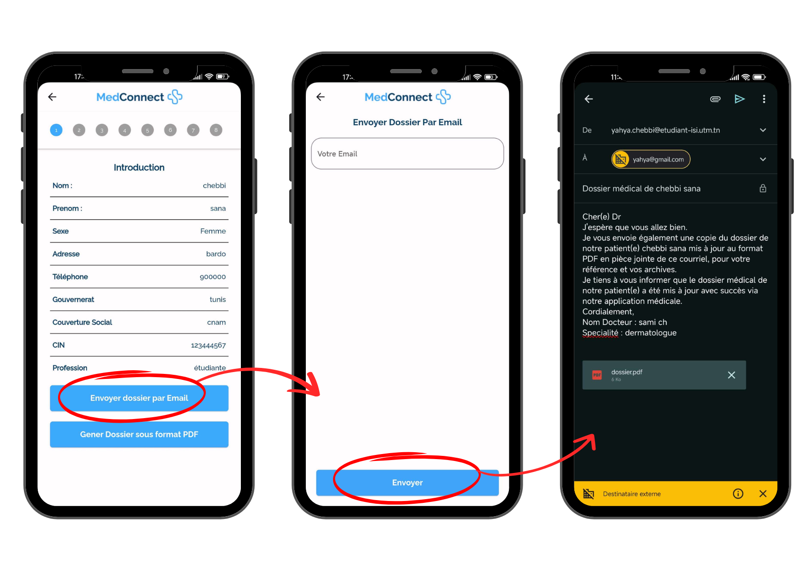
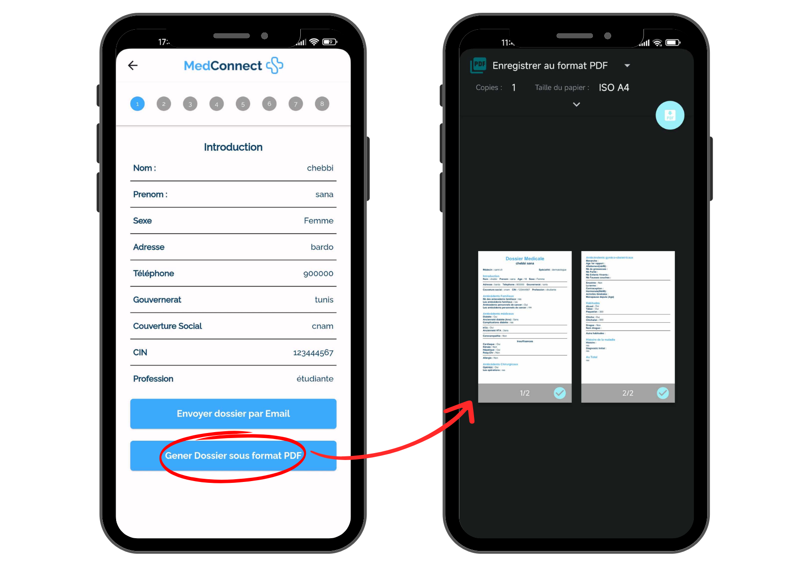
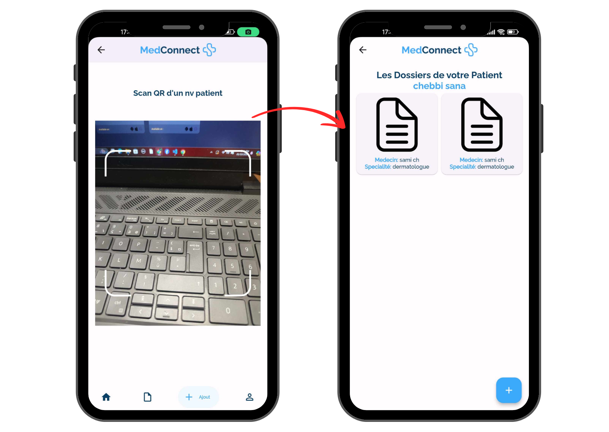

### MedConnect Patient (Mobile App)
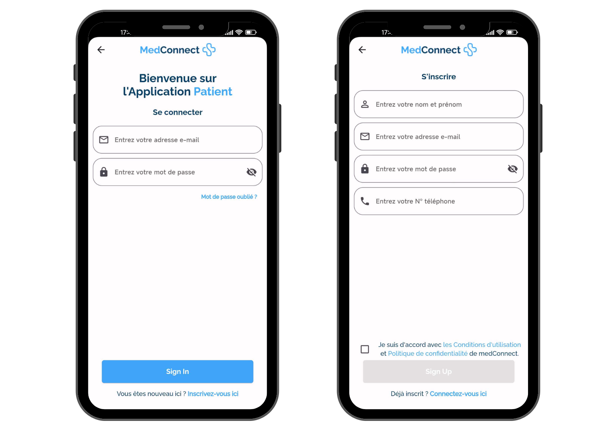
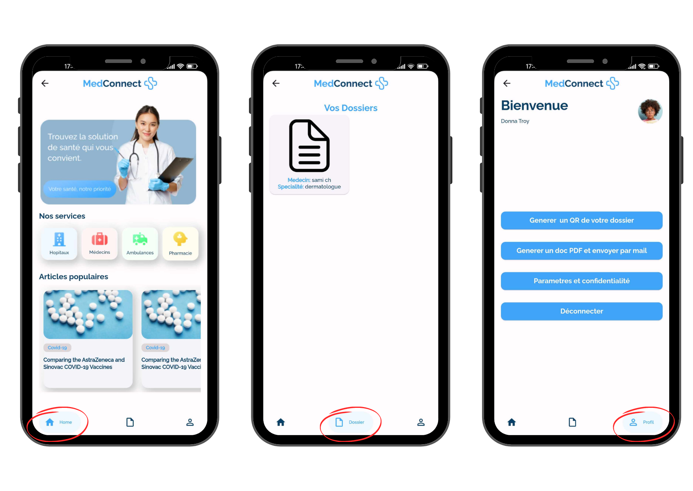
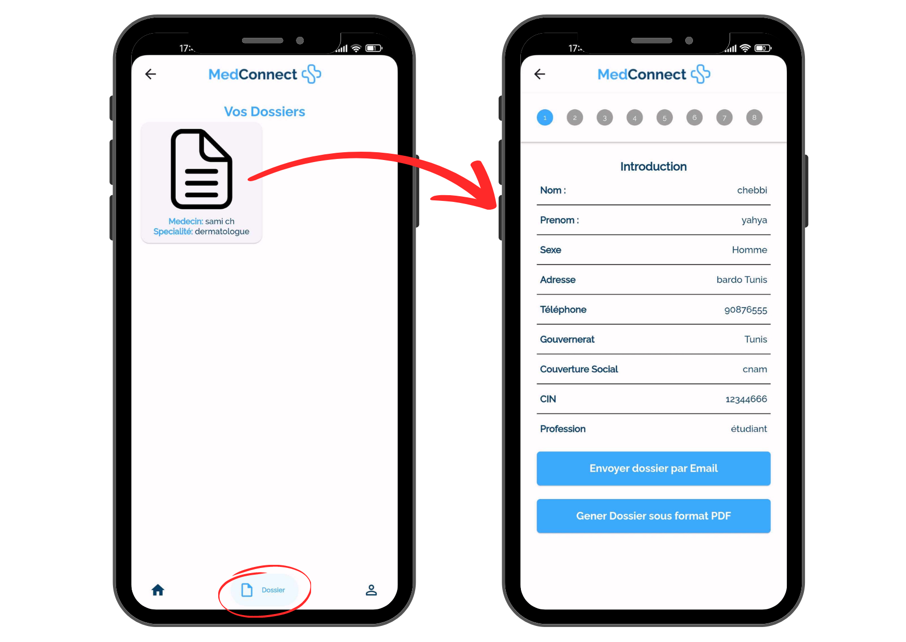
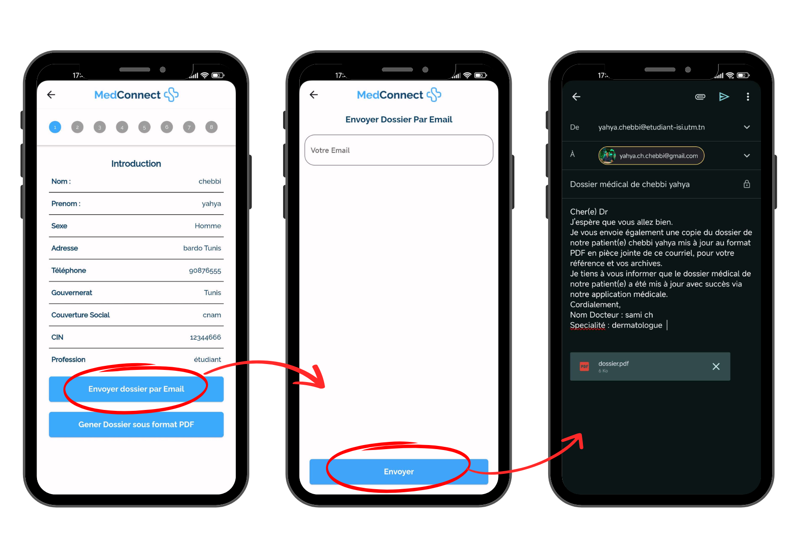

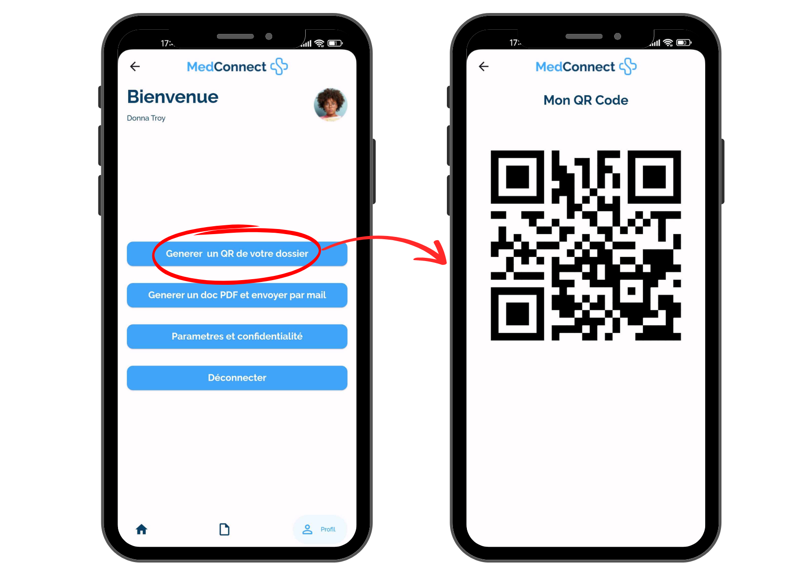

## Tech Stack

- **Flutter**: For building cross-platform mobile applications.
- **Dart**: The programming language used for Flutter apps.
- **Firebase**: Used for real-time data synchronization and storage.

## How to Run

### Apps Setup:

1. Clone the repository:
   ```bash
   git clone https://github.com/ChebbiYahya/Medical-Record-Digitization-Mobile-App-for-Patients-and-Doctors.git

2. Navigate to the project directory:
   ```bash
   cd medconnect-app

3. Install dependencies:
   ```bash
   flutter pub get

4. Run the app:
   ```bash
   flutter run